<p align="center"></p>

# OrbitMorph

**Drop. Spin. Convert. — 拖动文件，转盘选择，本地转换。**

OrbitMorph 是面向 Apple Silicon、macOS 14+ 的原生文件转换工具。按住修饰键并开始拖动 Finder 文件后，玻璃转盘出现在鼠标所在屏幕，滑向目标并松开即可生成新文件。SwiftUI/AppKit 负责交互，系统框架和本机转换器处理内容；文件不上传，没有账号或云端服务。

**当前版本：1.2.1。** 本轮彻底移除 Drop Window 和手动投放入口；首次教学改为窗口内 PNG/MP4 手势模拟，日常直接拖动 Finder 文件。沿用 58 种格式与既有本地后端。

## 界面预览

<p align="center">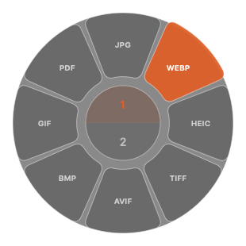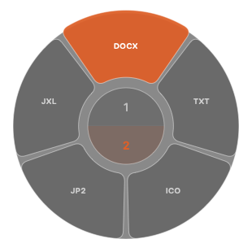</p>

| English tutorial | 中文教程 |
| --- | --- |
| 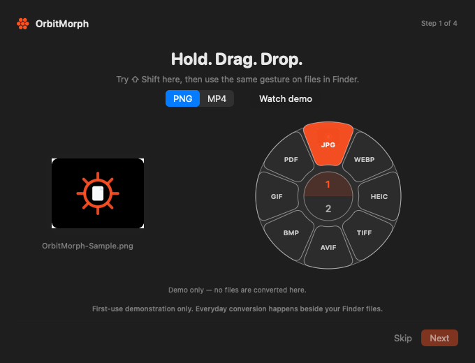 | 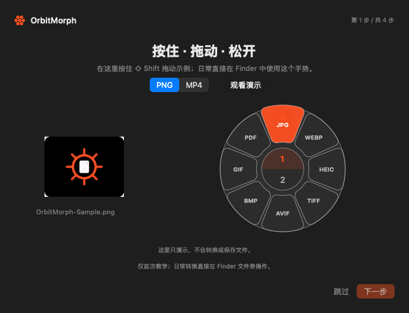 |

| MP4 tools demo | MP4 工具演示 |
| --- | --- |
| 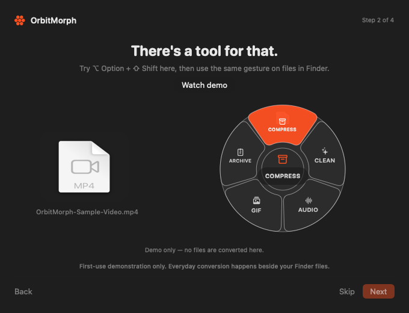 |  |

| English settings | 中文设置 |
| --- | --- |
| 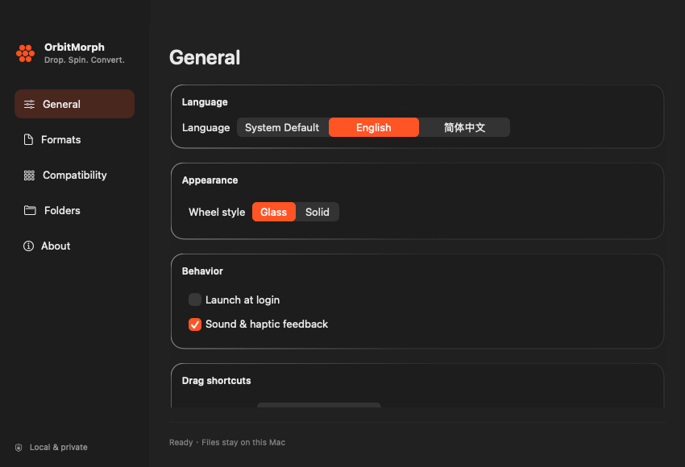 | 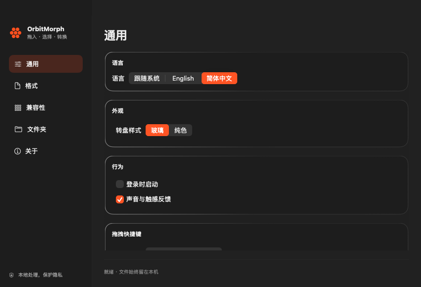 |

| 格式参数 | 格式兼容矩阵 |
| --- | --- |
| 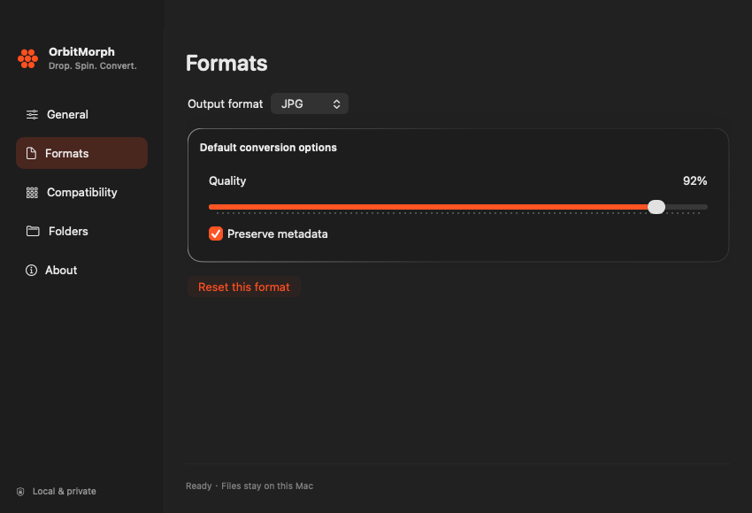 | 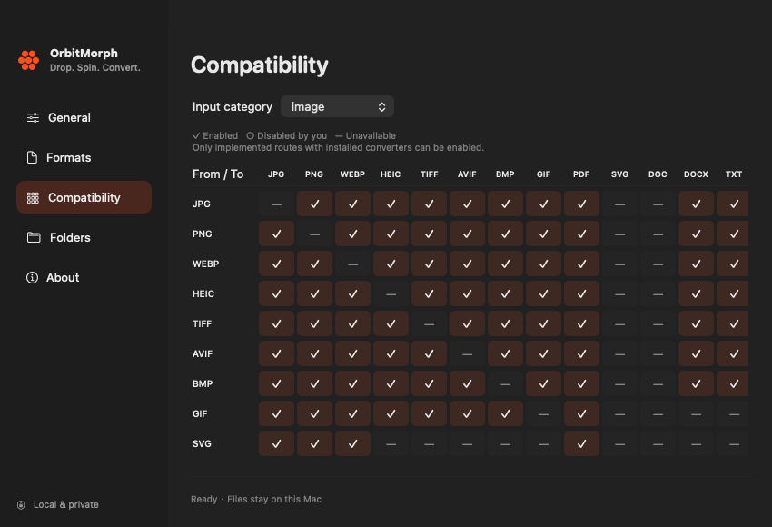 |

| 输出目录 | 本机转换器诊断 |
| --- | --- |
| 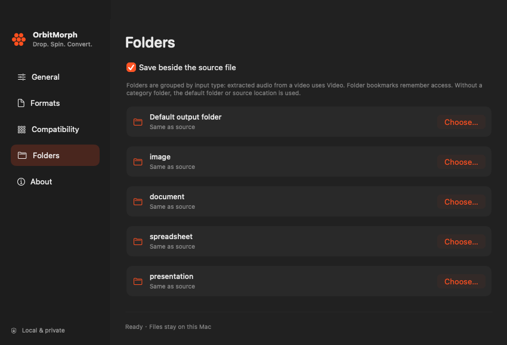 | 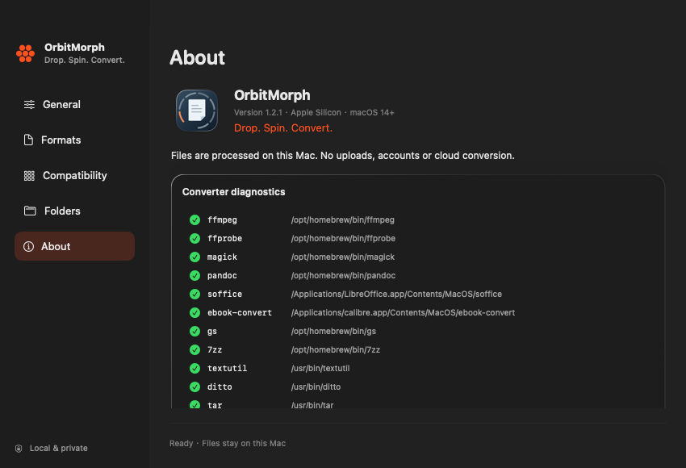 |

转盘截图使用 PNG 输入的实际可用目标，不混合演示其他类别。截图来自最终应用的真实 view 自渲染 CLI；它证明界面布局，实时桌面模糊、动画和 Finder 手势仍需运行中体验。[截图记录与重新生成方法](docs/screenshots/README.md)


## 核心能力

- **快捷键转盘**：按住 Shift 并开始拖动文件后转换，Option + Shift 使用工具；单独按修饰键不唤出。转盘跟随鼠标所在屏幕，多文件显示共同目标。
- **拖拽中翻页**：超过八个项目，中心纵向显示页码；拖到页码停留350ms切换外圈，移到目标再松手转换。中心松手不执行转换。
- **首次教程与中英文**：仅首次显示窗口内 PNG/MP4 教学，不转换或保存文件，关闭后不再出现；语言可跟随系统或选择 English/简体中文。
- **玻璃界面与反馈**：原生材质、悬停高亮、入场/退场动画、可选声音与触觉，尊重系统 Reduce Motion。
- **本地转换**：支持系统能力及 FFmpeg、ImageMagick、Pandoc、7-Zip、LibreOffice、Calibre，缺依赖就隐藏对应路线。
- **Office 与电子书**：表格、演示文稿家族互转和 PDF 输出；EPUB/MOBI/AZW3 互转，以及部分文档输入/输出。
- **文字提取**：图片和 PDF → TXT/DOCX；PDF 可用文本层与本地 Vision OCR，输出可编辑文字。
- **原文件保留**：先写临时文件并验证可读性，再排他提交；重名使用后缀，批次失败清理本批次产物。教学只使用内置样本作模拟，不调用转换器。

## 支持格式

当前识别 **58 种格式、9 个内容类别**。识别格式、可读取、可写出和具体路线是不同事实；可用目标由本机工具能力和兼容设置决定。

| 类别 | 格式 | 主要边界 |
| --- | --- | --- |
| 图片（13） | JPG、PNG、WEBP、HEIC、TIFF、AVIF、BMP、GIF、SVG、ICO、JP2、JXL、PSD | 常规图片互转；SVG/PSD 输入；PSD 读取合成图，输出栅格图，不保留图层编辑能力 |
| 文档（8） | PDF、DOC、DOCX、TXT、MD、RTF、HTML、ODT | 结构文档转换、PDF 逐页转图、TXT/DOCX 文字提取；依赖相应 backend |
| 表格（3） | XLS、XLSX、ODS | LibreOffice 家族互转及 PDF；不承诺宏、复杂图表和全部公式兼容 |
| 演示（3） | PPT、PPTX、ODP | LibreOffice 家族互转及 PDF；复杂母版、动画和字体可能变化 |
| 电子书（3） | EPUB、MOBI、AZW3 | Calibre；家族互转和 TXT/DOCX/PDF 输出；TXT/HTML/DOCX 可生成电子书 |
| 音频（10） | MP3、M4A、AAC、WAV、FLAC、OGG、OPUS、AIFF、WMA、CAF | FFmpeg；增强目标用 ffprobe 读取实际编码流后开放 |
| 视频（10） | MP4、MOV、MKV、WEBM、AVI、M4V、WMV、FLV、TS、3GP | FFmpeg；视频互转、GIF、音频抽取，抽音频需要音轨；增强输出需要 ffprobe |
| 归档（6） | ZIP、7Z、TAR、TGZ、GZ、RAR | 输出 ZIP/7Z/TAR/TGZ；GZ/RAR 仅输入 |
| 字幕（2） | SRT、VTT | 原生 UTF-8 基础字幕双向转换 |

JPEG/TIF/HEIF 等别名不重复计数。MTS/M2TS 归为 TS 输入，输出是普通 MPEG-TS，不承诺保持蓝光 M2TS 封装。专业 RAW、EXR、矢量编辑/矢量输出仍不支持。

[转换路线报告](docs/verification/转换路线验收.md) · [机器可读矩阵](docs/verification/conversion-matrix.json) · [详细覆盖与路线图](docs/FORMAT_COVERAGE.md)

## 安装与使用

运行 app 需要 Apple Silicon、macOS 14+；从源码构建另需 Swift 6 工具链。

```sh
git clone https://github.com/samni728/OrbitMorph.git
cd OrbitMorph

# 按场景安装可选本地工具
brew install ffmpeg imagemagick pandoc sevenzip ghostscript
brew install --cask libreoffice calibre

swift run OrbitMorph
```

不安装可选工具也能启动；ImageIO、PDFKit、Vision、textutil、ditto、tar 提供部分系统能力。`brew install ffmpeg` 同时安装 ffprobe；WMV/WMA/FLV/TS/3GP/CAF 输出依赖它验证真实流，缺失时隐藏这六类增强目标。工具不随 app/DMG 分发，应用也不自动下载安装。新装工具后重启应用，在 About 检查路径。

1. 首次启动可在教学窗口选择 PNG/MP4，按住快捷键拖动示例，或点击“观看演示”；可直接关闭或跳过，之后不再显示。
2. 按住 **Shift** 并开始拖动 Finder 文件，在鼠标所在屏幕的转盘滑向目标后松开。
3. 目标超过八个时，拖到中心页码停留 **350ms**，等外圈切换后移到目标再松手；两页上1下2，三页从上到下1/2/3。
4. 按住 **Option + Shift** 拖动 Finder 文件打开工具转盘。菜单仅保留设置、关于、最近输出和退出。
5. 在中心松手不转换；释放修饰键、移出后松开或按 Escape 可取消尚未提交的拖拽。

默认保存到源文件旁；Settings → Folders 可配置目录，分类按输入类型，如视频抽音频使用 Video。[完整使用指南](docs/USER_GUIDE.md)

应用按单实例运行；再次启动会激活已有实例，新启动进程退出。若仍有旧版本同时运行，先退出所有旧版本再打开当前 app。

## 构建、截图与打包

```sh
scripts/build-app.sh
scripts/capture-screenshots.sh
scripts/package-dmg.sh
scripts/verify-package.sh
```

产物为 `dist/OrbitMorph.app` 和 `dist/OrbitMorph.dmg`，不纳入 Git。支持 `VERSION`、`BUILD_NUMBER`、`ARCH`、`SCRATCH_PATH`、`APP_PATH` 等覆盖项；默认版本 1.2.1、arm64/macOS 14+。验收指定其他版本时设置 `EXPECTED_VERSION`。

包中包含原创图标、许可说明、中英语言目录、教程 PNG/MP4 与 WAV 反馈声音；转换器保持外部安装。资源验收需要开发机安装 FFmpeg/ffprobe，会真实解码样本视频并检查声音 PCM 数据、语言 JSON、签名和 DMG 挂载内容。当前使用 **ad-hoc 签名**，尚未做 Developer ID 签名或公证。

## 验证

```sh
swift test
ORBITMORPH_FULL_MATRIX=1 swift test
scripts/verify-package.sh
git diff --check
```

常规测试默认跳过全路线矩阵；显式开启后使用生成或官方夹具，真实转换并读取产物。Office 回读检查页/工作表顺序、中文、数值及基础公式；电子书检查两章正文和可读 PDF；OCR 覆盖混合文本层与扫描正文、旋转页和失败清理。提交前拒绝空产物及损坏 DOCX/PDF，媒体探测通过 ffprobe 验证实际流。RAR 使用 [libarchive 官方夹具](https://github.com/libarchive/libarchive/blob/master/libarchive/test/test_read_format_rar5_stored.rar.uu)。

**1.2.1 最终验收：177 项测试，0 失败、0 跳过；本机 554/554 条路线真实转换通过，0 未覆盖。** arm64/macOS 14+ 应用、18 张中英文真实 view 截图、资源与 ad-hoc 签名、DMG 挂载/卸载检查全部通过。测试分两批：176 项普通回归与 1 项完整矩阵测试。原完整进程在矩阵通过后被中断，其余项目已整批重跑。正常双进程启动只保留第一实例；页码停留和中心拒绝转换通过原生拖拽接口测试。

[验收摘要](docs/verification/release-summary.json) · [完整测试日志](docs/verification/final-swift-test.log) · [打包日志](docs/verification/packaging.log)

自动 GUI/状态机测试不能证明真实 Finder 快捷键拖拽全部通过。[验收进度与边界](docs/verification/开发进度.md)

## 架构与范围

```text
Sources/OrbitMorphApp/   窗口、教程、中英文、转盘与系统拖拽
Sources/OrbitMorphCore/  格式/路线、输出事务、本地后端 adapters
Tests/                  回归、真实转换矩阵、界面与资源检查
Resources/              图标、语言目录、教程样本、反馈声音、许可说明
scripts/                构建、实际应用截图、资源验收与DMG分发
docs/                   使用、架构、格式覆盖和验证证据
```

[架构与开发](docs/DEVELOPMENT.md) · [格式覆盖](docs/FORMAT_COVERAGE.md)

OCR 和 PDF → DOCX 输出文字，**不还原原始版式、表格或图片**。Office 复杂排版、宏和公式跨套件兼容受 LibreOffice 限制；电子书目录、封面、图片与元数据尚未全面保真验收，DRM 文件由后端报错。静态图片目标及 ImageIO 后备取首帧；无音轨媒体抽音频会失败；基础字幕以外的样式/布局语义不承诺保留。ExFAT 回退、跨机器签名公证仍需独立验收。

Next 聚焦百分比进度/取消、按内容过滤媒体目标与更多 PDF 操作；复杂多帧编辑、专业图像/矢量进入 Later。

OrbitMorph 使用原创品牌资产。外部工具适用各自许可，见 [Credits](Resources/Credits.md)。仓库目前未指定统一源码开源许可证。
